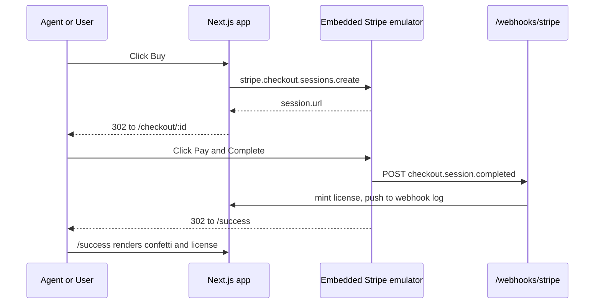

# Stripe Checkout your AI agent can actually run

A Next.js app that completes a full Stripe Checkout purchase loop with no Stripe account, no API keys, and no webhook tunnel. The Stripe emulator is embedded in the same Next.js process via [`@emulators/adapter-next`](../../packages/@emulators/adapter-next), so the pricing page, hosted Checkout, webhook delivery, and license fulfillment all happen inside `localhost:3000`.

The point: an agent that writes Stripe code can also run it. End-to-end. In a sandbox. With zero credentials.

## Why agents are blocked on real Stripe

Today, an agent that generates a Checkout integration can't actually exercise it:

- **API keys require a human at the dashboard.** Restricted keys, webhook secrets, test-mode toggles — all gated behind clicks.
- **Webhooks require a tunnel.** `stripe listen`, ngrok, or a Vercel preview that Stripe doesn't know about.
- **Sharing a key with the agent leaks it.** Once it's in a transcript, an MCP server, or a sandbox image, it's everywhere.
- **Real charges in CI cost money** and trip fraud rules.

So the agent stops at "I wrote the code" and asks the human to run it. The loop never closes.

## With emulate, the loop closes

```ts
const stripe = new Stripe("sk_test_emulated", {
  host: "localhost", port: 3000, protocol: "http",
});

const session = await stripe.checkout.sessions.create({
  mode: "payment",
  line_items: [{ price: "price_lifetime", quantity: 1 }],
  success_url: "http://localhost:3000/success",
});

await fetch(`${session.url}/complete`, { method: "POST" });

const completed = await stripe.checkout.sessions.retrieve(session.id);
// completed.status === "complete"
// completed.payment_status === "paid"
// /webhooks/stripe already fired and minted a license
```

`pnpm test` runs this in under 100 ms. No browser, no Stripe account, no internet, no secrets. See [tests/checkout.e2e.test.ts](tests/checkout.e2e.test.ts) for the version with explicit webhook assertions.

## Pair with agent-browser for an end-to-end agent demo

The headless test proves the API loop. To prove the user-facing loop, point [agent-browser](https://github.com/vercel-labs/agent-browser) at this app and let an agent click through the actual UI:

```bash
pnpm --filter stripe-checkout dev    # boots the app + embedded Stripe
agent-browser navigate http://localhost:3000
agent-browser click "Buy lifetime access"
agent-browser click "Pay and Complete"
agent-browser snapshot                # asserts /success rendered with a license key
```

No real Stripe account, no payment card, no webhook tunnel. The agent owns every box: the code it wrote, the Stripe it talks to, the browser it drives, and the assertions it makes.

## stripe-mock vs emulate

Stripe ships [`stripe-mock`](https://github.com/stripe/stripe-mock), a stateless server generated from the OpenAPI spec. It validates request shapes but cannot complete a flow.

|                  | stripe-mock           | emulate                                |
| ---------------- | --------------------- | -------------------------------------- |
| State            | stateless             | stateful                               |
| Hosted Checkout  | not provided          | `/checkout/:id` renders and completes  |
| Webhook delivery | not provided          | dispatched on every state change       |
| End-to-end flows | not possible          | purchase to fulfillment                |

`stripe-mock` returns shapes. `emulate` runs flows. Agents need the second one.

## Run it

```bash
pnpm install
pnpm --filter stripe-checkout dev    # http://localhost:3000
pnpm --filter stripe-checkout test   # the headless E2E loop
```

Open [http://localhost:3000](http://localhost:3000), click **Buy lifetime access**, complete checkout, watch the webhook overlay light up on `/success`.

## How it works



### Wiring the Stripe SDK to the embedded emulator

The Stripe Node SDK accepts `host`, `port`, and `protocol` but no path prefix. The embedded emulator lives at `/emulate/stripe/*`, so a single rewrite in [next.config.ts](next.config.ts) bridges the two:

```ts
async rewrites() {
  return [{ source: "/v1/:path*", destination: "/emulate/stripe/v1/:path*" }];
}
```

Then in [src/lib/stripe.ts](src/lib/stripe.ts):

```ts
export const stripe = new Stripe("sk_test_emulated", {
  host: "localhost",
  port: Number(process.env.PORT ?? 3000),
  protocol: "http",
});
```

### Webhook delivery

[src/app/emulate/[...path]/route.ts](src/app/emulate/[...path]/route.ts) configures the embedded emulator to deliver every Stripe event to `/webhooks/stripe` on the same origin:

```ts
createEmulateHandler({
  routePrefix: "/emulate",
  services: {
    stripe: {
      emulator: stripe,
      webhooks: [{ url: "/webhooks/stripe", events: ["*"] }],
    },
  },
});
```

The webhook dispatcher awaits delivery before issuing the post-payment redirect, so by the time the user lands on `/success`, the license has already been minted in [src/app/webhooks/stripe/route.ts](src/app/webhooks/stripe/route.ts). Relative URLs are resolved against the running origin, so the same config works on localhost and on every Vercel preview deployment — no webhook reconfiguration per branch.

## Caveats

- **Webhook signatures.** The emulator currently signs deliveries with `X-Hub-Signature-256` (GitHub style), not Stripe's `Stripe-Signature` header. The webhook handler `JSON.parse`s the body and includes a `// In production: stripe.webhooks.constructEvent(...)` comment for the swap.
- **Subscriptions.** The Stripe emulator supports one-time payments today (`mode: "payment"`). The lifetime-license model fits that naturally.

## Project structure

```
src/
  app/
    page.tsx                   # Pricing page, single Buy CTA
    checkout/actions.ts        # createCheckoutSession server action
    success/page.tsx           # Confetti and license key
    dashboard/page.tsx         # All issued licenses
    webhooks/stripe/route.ts   # Mints license on checkout.session.completed
    api/webhook-log/route.ts   # Feed for the live overlay
    emulate/[...path]/route.ts # Embedded Stripe emulator + webhook config
  components/
    webhook-overlay.tsx        # Live ticker shown during the demo
    confetti.tsx
  lib/
    stripe.ts                  # SDK pointed at the embedded emulator
    licenses.ts                # In-memory license store
    webhook-log.ts             # In-memory webhook event log
tests/
  checkout.e2e.test.ts         # The headless purchase loop
```
